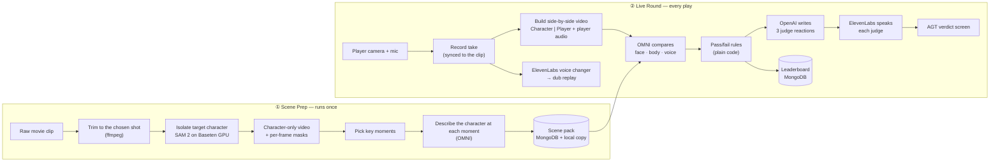

# SceneStealer — Project Handoff v4 (Hack the North 2026)

> **For:** teammates and coding agents (Claude Code, Codex, etc.).
> **Scope of this version:** one working demo of **one uncut scene**. Multi-scene progression is out of scope for now.
>
> ## ⚠️ READ FIRST: the scene is NOT fixed
> **The final movie scene has not been chosen.** Throughout this doc, *Interstellar*'s "messages" scene (the player acts as Cooper, played by Matthew McConaughey) is used **only as a worked example** to make things concrete.
>
> **Rules for anyone building this:**
> 1. **Never hardcode** a movie, character, actor, line of dialogue, timestamp, or file name anywhere in the code, prompts, UI text, or voice settings.
> 2. **Everything scene-specific lives in one place: the scene pack** (see section 6.1). The code reads the movie title, character name, briefing text, tips, clip paths, key moments, thresholds, and dub voice from it.
> 3. **Swapping scenes should mean re-running Scene Prep on a new clip, and nothing else.** No code changes.
> 4. The few places below that still mention Cooper, McConaughey, or *Interstellar* are **clearly labeled examples**. The code should always say **"the target character"** and **"the chosen movie"**, with names read from the scene pack.
> 5. Test with **at least two different clips** (for example, a short dev clip plus the example) to prove nothing is hardcoded.
>
> **Golden rule:** if a sponsor booth tells you something different from this doc, the booth wins. Update the doc.

---

## 1. The game in one paragraph

You play **one character from a real movie scene** (the **target character**). On one side of the screen you see that character **cut out from the movie**, so you can clearly follow their expressions and body language. On the other side you see yourself. When the scene ends, a **multimodal AI compares your face, body, and voice to the character's**. Then a panel of **three America's-Got-Talent-style judges** (animated sprites with their own voices) each give you funny feedback and a **YES or NO**. Get **three YESes** and you advance; otherwise you try again as many times as you like. You also get a **replay of your performance, dubbed in a character voice**.

*Example used throughout this doc:* playing Cooper (Matthew McConaughey) in the "messages" scene from *Interstellar*. This is **just an example**; the real scene is chosen later.

---

## 2. Decisions locked in

| Topic | Decision |
|---|---|
| Scene | **Not chosen yet; must be swappable.** One real movie scene per demo, one continuous stretch with no edits, and the player always plays **one target character** chosen during Scene Prep. (Example in this doc: *Interstellar*'s "messages" scene, as Cooper.) |
| Character isolation | Done **ahead of time** on a cloud GPU using **SAM 2 hosted on Baseten** |
| Comparing player vs target character | **Huawei OMNI model (Qwen3.5-Omni)** scores face, body, and voice. Scores are "logical, not exact." |
| Judge personalities / feedback | **OpenAI API** writes the judges' lines (Codex used to help build it) |
| Judges | **3 judges**: one for **facial expression**, one for **body/pose**, one for **voice**. Sprites provided by Alex (idle, talking, yes, no). |
| Judge voices | **ElevenLabs**: spoken aloud *plus* text speech bubbles |
| Pass rule | Each judge says YES if their category clears a threshold. All three YES = pass. |
| Failing | Unlimited retries |
| Extras kept | **Dub replay** (ElevenLabs voice changer), **MongoDB Atlas** leaderboard, **GoDaddy** domain |
| Dropped | LeLamp robot, Sentry |

---

## 3. The player's experience, screen by screen

*Text in quotes below uses the Interstellar example. In the app, all of it comes from the scene pack.*

1. **Title screen.** "SceneStealer: Can you out-act [actor]?" (for example, "…out-act McConaughey?"). Enter a nickname, then press Start.
2. **Scene briefing (about 10 seconds).** A short card (from the scene pack) sets the moment and gives a tip. Example: "Cooper returns and watches 23 years of messages from his kids. Watch his face; this scene is all about the eyes."
3. **Get ready.** Camera check with a framing guide ("sit so your head and shoulders fill the box"). Headphones prompt (see section 4). 3-2-1 countdown with a drumroll.
4. **Performance.**
   - **Left:** the isolated target character plays on a dark background.
   - **Right:** your live camera.
   - The scene audio plays through the headphones as your cue, while subtitles show the lines.
   - A progress bar shows the time remaining.
   - Optional live feedback: a subtle face-mesh or skeleton overlay on you, just for feel.
5. **Deliberation (covers the AI wait).** The stage lights dim, the three judge sprites switch to "whispering," and a drumroll plays with the caption "The judges are deliberating…"
6. **The verdict, AGT style.** Judges go one at a time. For each judge:
   - The sprite switches to **talking**, their voice plays, and a speech bubble shows the text.
   - The funny feedback is tied to their category ("Your chin quiver at 0:14? Oscar material. Your eyebrows? Community theatre.").
   - The sprite switches to **YES** or **NO**, with a matching sound effect (ding or buzzer).
7. **Result.**
   - **3 YESes:** confetti and "You're going through!" (a placeholder "Next round" card, since only one scene exists for now).
   - **Anything less:** "So close!" A **Try Again** button shows the tip from whichever judge said NO.
8. **Dub replay.** A side-by-side replay of you and the target character, synced, with your voice transformed into a character voice.
9. **Leaderboard.** Your best combined score, ranked live.

**One round should take about 90 seconds end to end.** The performance itself is 20–40 seconds.

---

## 4. Choosing a scene (plus a worked example)

### 4.1 What makes a good scene
Use this checklist when picking the final scene:
- **One continuous shot** of 20–40 seconds that stays on the target character. Short cutaways are OK; they get skipped (see below).
- **One clearly visible target character**, ideally not overlapping heavily with other people (it makes SAM 2 isolation much cleaner).
- **Visible face** most of the time (the face judge needs it).
- **Some body language** that a player can reproduce seated or standing in front of a laptop camera.
- **Some vocal performance** by the target character: lines, laughs, sobs, shouts.
- **Iconic and recognizable**, so judges and the crowd get it instantly.

### 4.2 Things that vary between scenes (all set in the scene pack)
- **How much each judge matters:** a quiet facial scene should have a lower body threshold. An action scene might need a lower face threshold.
- **Whether the voice judge scores words or just delivery:** dialogue-heavy scenes can score line delivery; non-verbal scenes score emotional vocal reactions.
- **Whether other characters' voices are in the soundtrack.** If so, headphones are required (see below).
- **Briefing text, tips, title-screen text, and the dub voice style.**

### 4.3 Rules that apply to every scene
- **The player wears headphones** whenever the scene's audio plays during the take, so it doesn't bleed into their microphone and confuse the voice judge. Fallback with no headphones: mute the movie audio during the take and show subtitles only.
- **Frames without the target character** (cutaways) are detected automatically, because SAM 2 finds no mask there. Those moments are skipped when scoring, and the UI shows "(hold your reaction)" during them.
- **Copyright:** real movie clips are for the live hackathon demo only. Keep them in the **gitignored** `assets/private/` folder and never commit them to the public repo.

### 4.4 Worked example: *Interstellar*, "messages" scene (example only)
How the example scene maps onto the checklist above:

- **It's a facial-acting scene.** Cooper is mostly seated and reacting to a screen, so the *face* judge will carry the most weight. The *body* judge scores posture, head and shoulder movement, hands to face, and leaning in. That's fine; tune the body judge's threshold accordingly.
- **Cooper's voice is mostly non-verbal** in this scene (reactions, breaths, laughing through tears) rather than long dialogue. The voice judge scores **emotional vocal delivery** (does your voice crack, do you laugh or sob at the right moments), not line accuracy.
- **The clip's soundtrack contains other characters' voices** (the video messages), so headphones are required.
- **The film cuts** between Cooper and the screen he's watching, so you'd pick a 20–40 second stretch that stays on Cooper.
- **Scene pack settings you'd choose:** body threshold lower than face; voice judge scores emotional delivery; headphones required.

---

## 5. Architecture overview

There are **two pipelines**:

1. **Scene Prep** (runs **once**, before the demo). This turns the raw movie clip into everything the game needs: the isolated target-character video, a list of key moments, and a written "reference sheet" describing what the character does at each moment.
2. **Live Round** (runs **every time someone plays**). This records the player, compares them to the reference, and runs the judges.

Doing the heavy work once in Scene Prep keeps the live game fast, cheap, and reliable.



### 5.1 Who does what (the "perceive → decide → perform" split)

| Step | Handled by | Why it's split this way |
|---|---|---|
| **Isolate** the target character from the movie | SAM 2 on **Baseten** | Needs a big GPU; only needs to happen once |
| **Perceive**: compare expressions, poses, and voice | **Huawei OMNI** | The only model here that can watch *and* listen in one pass |
| **Decide** YES or NO | **Plain code** (thresholds) | Predictable and tunable; the AI never decides the outcome |
| **Perform**: funny judge dialogue | **OpenAI** | Great at persona writing and returns clean structured output |
| **Voice** the judges and the dub | **ElevenLabs** | Expressive voices, low latency, voice changer |
| **Remember** scores | **MongoDB Atlas** | Leaderboard with live updates |

**Why the vote is decided in code, not by the AI:** if the AI decided YES/NO, the same performance could pass one time and fail the next, which feels unfair to players. Code applies the threshold. The AI only writes a reaction that *matches* the vote it's given.

---

## 6. Scene Prep pipeline in detail

Scene Prep is a **generic pipeline**: give it any movie clip plus a small config file, and it produces a scene pack. It must work for any scene, not just the example.

### 6.1 The scene config and scene pack (the ONLY place scene details live)

**Input: `scenes/<scene_id>/scene.yaml`**, written by a human when a scene is chosen. Example values shown for the Interstellar example:

```yaml
scene_id: interstellar-messages        # any slug
movie_title: "Interstellar"
character_name: "Cooper"
actor_name: "Matthew McConaughey"
clip_file: assets/private/interstellar-messages/raw.mp4
start: "00:00:12"                      # the continuous shot to use
end: "00:00:44"
character_select:                      # where the target character is in the first frame
  box: [410, 120, 820, 700]            # or a click point; set via the prep tool
briefing: "Cooper returns and watches 23 years of messages from his kids."
tip: "Watch his face: this scene is all about the eyes."
title_line: "Can you out-act McConaughey?"
voice_mode: emotional                  # "emotional" (non-verbal) or "lines" (dialogue)
other_voices_in_audio: true            # true → headphones required
thresholds: { face: 70, body: 60, voice: 70 }
dub_voice_style: "gravelly, warm, slow Southern drawl"   # used to DESIGN a voice, never to clone one
```

**Output: the scene pack** (saved to MongoDB plus a local JSON copy) contains everything from the config, plus:
- Paths to the isolated video, masks, subtitles, and the cue audio.
- The key moments with their reference descriptions.
- The ElevenLabs voice ID designed for the dub.
- A source/license note.

**The app loads whichever scene pack is marked active** (by an env var or a setting). Nothing else in the codebase knows which movie is being used.

### Step 1 — Trim
Use ffmpeg to cut the chosen continuous shot (20–40 seconds). Normalize it to a standard resolution and frame rate (for example, 720p at 24–30 fps).

### Step 2 — Isolate the target character with SAM 2 on Baseten
- **How SAM 2 works:** you click on (or draw a box around) the target character in the **first frame**, and the model **follows them through the whole clip**, producing a mask for every frame.
- **Deployment:** package SAM 2 as a **custom Truss** (Baseten's packaging tool). The Truss loads the model and exposes a "segment this video given this click/box" endpoint. Run it on a single mid-range GPU.
- **Outputs:**
  - `isolated.mp4`: the target character on a dark or blurred background. This is what the player watches.
  - `masks/`: the per-frame masks. They mark frames where the character isn't visible, and they enable the dub-replay stretch goal.
- **Selecting the character:** the prep tool should show the first frame and let a human click the target character (or accept a box in the scene config). Store that click/box in the scene pack so prep is repeatable.
- **Before building:** check Baseten's HTN starter repo (`github.com/basetenlabs/Hack-the-North-2026`) for examples and credits, and ask the booth whether they have a ready-made SAM model.
- **Escape hatch:** if Baseten deployment stalls, run the same SAM 2 script on any available GPU (Colab or a teammate's machine) so the demo isn't blocked. Keep pushing on the Baseten version for the prize, though.

### Step 3 — Pick key moments
Choose about **6–10 moments** across the clip where the character's expression or posture clearly changes (in the Interstellar example: "first smile," "breaks down," "hand over mouth").

The simplest reliable approach: sample a frame every few seconds, then have OMNI (or a human) confirm which frames are meaningful. Store each moment's timestamp.

### Step 4 — Write the reference sheet with OMNI
Send the isolated clip (with its audio) to OMNI **once**. Ask it to describe, for each key moment:
- **Face:** the expression and its intensity.
- **Body:** posture, head, hands.
- **Voice:** the vocal reaction (laugh, sob, breath, silence).

Tell OMNI the character's name and to focus on **that character's own** vocal sounds, ignoring any other voices in the soundtrack. Save the result.

> This runs once and is cached, so it barely touches the OMNI credit budget.

### Step 5 — Save the scene pack
Combine the config, the prep outputs, and the reference sheet into the scene pack (section 6.1). Save it to MongoDB with a local JSON copy for offline use. Running `make prep SCENE=<scene_id>` should do all five steps end to end.

---

## 7. Live Round pipeline in detail

### 7.1 Recording in sync
The reference video and the recording **start together** and run for the same length. That means "second 14 of the player's take" lines up with "second 14 of the character's performance" automatically. There's no need for fancy alignment.

The browser records **camera + microphone only**. The movie audio goes to the headphones and is not recorded.

### 7.2 The side-by-side trick (key design choice)
The OMNI API takes text plus **one** video per request. So the backend uses ffmpeg to build **one side-by-side video**:
- **The isolated target character on the left, the player on the right**, frame-synced.
- The audio track is **the player's microphone audio**.

Now OMNI can look at both people *at the same moment* in a single call. That makes the comparison natural and cheap. Downscale the video (for example, to 480p) before sending; OMNI samples roughly one frame per second anyway.

### 7.3 What OMNI is asked

**Instructions:**
- "Left is the reference actor playing [character name from the scene pack], right is the player. Here is the reference sheet for each key moment. For each moment, compare the player to the reference on face, body, and voice." (The character name, movie title, and `voice_mode` are filled in from the scene pack.)
- "Give each category a 0–100 score with a one-sentence reason, and note the player's best and worst moment."
- "Be fair: this is a fun game, and 'logical' matters more than 'exact'."
- "Respond with JSON only."

**What comes back (the "comparison report"):**
- A face score, body score, and voice score, each with a short reason.
- Per-moment notes (what matched and what didn't).
- The best moment and worst moment, with timestamps.
- A flag if the player wasn't visible or was silent.

**Robustness:** validate the JSON. If it's malformed, retry once. If it fails again, or takes longer than about 8 seconds, fall back (see section 12).

### 7.4 Pass/fail rules (plain code)
- Each judge owns one category: **Face judge ↔ face score**, **Body judge ↔ body score**, **Voice judge ↔ voice score**.
- A judge votes **YES** if their score meets their threshold. Thresholds come **from the scene pack**, since they depend on the scene (the Interstellar example uses 70 face, 60 body, 70 voice because it has little movement). Global defaults of 70/70/70 apply if a scene doesn't set them. Tune per scene during playtests.
- **All three YES = pass.**
- **Optional "Golden Buzzer"** easter egg: if all three scores are very high (for example, 90+), trigger a special gold-confetti moment. It's a cheap, crowd-pleasing touch.

### 7.5 The judges (OpenAI)
**One OpenAI call writes all three judges' reactions at once** (faster than three calls). It uses **structured output**, so the reply is always valid JSON.

**What it's given:**
- Each judge's persona and category.
- That judge's score, reason, and **their already-decided vote**.
- The best and worst moments.
- Style rules.

**What it returns, per judge:**
- A short spoken reaction (under about 2 sentences).
- A slightly longer speech-bubble version.
- A coaching tip, used on the retry screen if the vote was NO.

**Style rules:**
- Funny and specific.
- Roast the *acting*, never the person's looks.
- PG-13.
- Reference at least one concrete moment.
- The reaction must match the given vote.

**Personas:** three **original** characters that match Alex's sprites. For example: a blunt critic (face), a hyperactive hype-man (body), and a dramatic theatre diva (voice). Don't impersonate real AGT judges by name or voice.

**Codex evidence for the OpenAI prize:** build this judge module (and its tests) with Codex, and log what Codex did in `docs/codex-log.md`.

### 7.6 Voices (ElevenLabs)
- **Design three judge voices** once with ElevenLabs Voice Design (from text descriptions), and save their voice IDs.
- Use the **low-latency speech model** for the judges' live lines, **streamed** so judge 1 can start talking while judges 2 and 3 are still being generated.
- **Pre-generate sound effects** once and cache them: drumroll, YES ding, NO buzzer, applause, golden buzzer, confetti pop.
- **Dub replay:** run the **voice changer** on the player's recorded audio, converting it into a voice **designed** from the scene pack's `dub_voice_style` description (for the example: "gravelly Southern drawl"). Design the voice once during Scene Prep. **Never clone the real actor's voice** or any real person's voice.

### 7.7 Dub replay
- **Must-have version:** a side-by-side replay (the same side-by-side video from 7.2), with the voice-changed audio.
- **Stretch version:** use the SAM 2 masks to hide the target character in the original frame, and place the player's cutout (from browser segmentation) roughly where the character was. This is "you in the movie."

### 7.8 Speed plan
Rough timeline after the take ends:

| Step | Time |
|---|---|
| Build the side-by-side video | ~1 s |
| OMNI comparison | ~3–5 s |
| OpenAI judges | ~1–2 s |
| First judge voice starts | ~0.5 s |

That's about **6–8 seconds**, which is fully covered by the deliberation animation (drumroll + whispering judges). Start the dub processing in parallel. It isn't needed until after the verdict.

---

## 8. Tech stack

| Layer | Choice | Why |
|---|---|---|
| Frontend | **Vite + React + TypeScript** | Fast to build, agents know it well |
| Styling / animation | **Tailwind CSS + Framer Motion** | Polished stage, lights, and sprite transitions with little code |
| Frontend state | **Zustand** | One simple store for the game's screens and round state |
| Camera + recording | **Browser MediaRecorder** (camera + mic) | Built in; records one video file with audio |
| Optional live overlay | **MediaPipe Face Landmarker / Pose** (in browser) | Makes the performance screen feel alive; also a fallback score source (section 12) |
| Backend | **Python 3.11 + FastAPI** | Handles video tooling, AI calls, and validation well |
| Validation | **Pydantic v2** | Defines every JSON shape once and checks AI replies against it |
| Video processing | **ffmpeg** | Trimming, side-by-side video, downscaling, audio extraction |
| Isolation (prep) | **SAM 2 packaged with Truss, hosted on Baseten** | GPU-heavy, runs once; Baseten prize |
| Perception / comparison | **Qwen3.5-Omni via yibuapi** (OpenAI-compatible API) | Watches and listens together; Huawei prize |
| Judge writing | **OpenAI API with structured outputs** | Reliable JSON, strong persona writing; OpenAI prize |
| Voices + SFX + dub | **ElevenLabs SDK** | Voice design, streaming speech, sound effects, voice changer; ElevenLabs prize |
| Database | **MongoDB Atlas** | Scene packs, round results, live leaderboard; MLH prize |
| Live updates to the browser | **Server-Sent Events** (simple one-way stream) | Pushes "judging… verdict ready… dub ready" without the complexity of WebSockets |
| Hosting | **Run locally on the demo laptop**; optional hosted leaderboard page on the GoDaddy domain | Local means reliable on stage |
| Tooling | **uv**, **pnpm**, **pytest**, **Vitest**, a **Makefile** (`make dev` starts everything) | Fast setup, one command to run |

---

## 9. Components and folders

```
/
├── HANDOFF.md              ← this file
├── README.md               ← setup/run steps (required by the Huawei track)
├── Makefile                ← make dev / make prep / make test
├── .env.example
├── docs/
│   ├── codex-log.md        ← OpenAI prize evidence
│   └── devpost-draft.md
├── scenes/                 ← one folder per scene: scene.yaml (+ generated scene pack)
├── prep/                   ← generic Scene Prep pipeline (run once per scene)
│   ├── trim.py            ← all prep scripts take --scene <scene_id>
│   ├── isolate_client.py   ← calls the SAM 2 endpoint on Baseten
│   ├── keyframes.py
│   ├── annotate_reference.py  ← OMNI reference sheet
│   └── build_pack.py
├── infra/truss/sam2/       ← the Baseten Truss for SAM 2
├── server/                 ← FastAPI backend
│   ├── main.py             ← routes + event stream
│   ├── round/              ← round lifecycle (recording → judging → verdict → dub)
│   ├── media/              ← ffmpeg helpers (side-by-side, downscale, audio)
│   ├── compare/            ← OMNI client, prompt, response validation, fallback
│   ├── rules/              ← thresholds, votes, golden buzzer
│   ├── judges/             ← OpenAI persona prompts + structured output
│   ├── voice/              ← ElevenLabs speech, SFX cache, voice changer
│   └── store/              ← MongoDB + local JSON fallback
├── web/                    ← React app
│   └── src/
│       ├── screens/        ← Title, Briefing, Ready, Perform, Deliberation, Verdict, Result, Dub, Leaderboard
│       ├── stage/          ← judge desk, sprites, speech bubbles, lights, confetti
│       ├── capture/        ← camera, recording, framing guide
│       └── api/
└── assets/
    ├── judges/             ← Alex's sprites (see section 10)
    ├── sfx/                ← cached sound effects
    ├── fallback/           ← pre-generated judge lines for offline mode
    └── private/            ← movie clips + isolated videos, per scene (gitignored)
```

### 9.1 Backend routes

| Method | Route | What it does |
|---|---|---|
| GET | `/health` | Shows which services (OMNI, OpenAI, ElevenLabs, MongoDB) are reachable |
| GET | `/scene` | The **active** scene pack (whichever scene is configured) |
| POST | `/rounds` | Start a round (nickname) → returns a round ID |
| POST | `/rounds/{id}/take` | Upload the recorded take |
| GET | `/rounds/{id}/events` | Live event stream: `judging`, `verdict_ready`, `dub_ready`, `error` |
| GET | `/rounds/{id}` | The full result: scores, votes, judge lines, audio links, dub link |
| GET | `/leaderboard` | Top players |

### 9.2 The round result (what the verdict screen receives)
- Round ID, nickname, and attempt number.
- Face, body, and voice scores, plus a combined score for the leaderboard.
- For each of the three judges:
  - Name and category.
  - Vote (YES/NO).
  - Spoken line, speech-bubble text, and coaching tip.
  - An audio file link.
- Best moment and worst moment.
- Whether the round passed, and whether it was a golden buzzer.
- A dub replay link (arrives slightly later).
- Whether a fallback was used (so the UI can show a small "judges on a coffee break ☕" note).

### 9.3 Environment variables

```
OMNI_BASE_URL=           # from the yibuapi credit email
OMNI_API_KEY=
OMNI_MODEL=              # the better model for the demo
OMNI_MODEL_DEV=          # the cheaper model for development
OPENAI_API_KEY=
OPENAI_MODEL_JUDGES=
ELEVENLABS_API_KEY=
VOICE_JUDGE_FACE=
VOICE_JUDGE_BODY=
VOICE_JUDGE_VOICE=
# the dub voice ID lives in the scene pack, not here
BASETEN_API_KEY=
SAM2_ENDPOINT_URL=
MONGODB_URI=
ACTIVE_SCENE=interstellar-messages   # example; any scene_id
DEFAULT_THRESHOLD=70                 # used only if the scene pack sets none
```

---

## 10. Judge sprite spec (for Alex's assets)

- **One folder per judge:** `assets/judges/<judge_id>/`
- **Four images per judge**, named exactly: `idle.png`, `talking.png`, `yes.png`, `no.png`
- **Format:** PNG with a transparent background. The same canvas size for all four states of a judge, and ideally for all judges (for example, 512×512), so swapping states doesn't make them jump.
- **Plus a small `judge.json` per judge:** display name, category (face/body/voice), ElevenLabs voice ID, and a one-line persona description the OpenAI prompt uses.

**How the UI animates them with only four images:**
- **Idle:** gentle up-and-down "breathing" bob.
- **Talking:** swap between `talking` and `idle` a few times per second while their voice plays. It reads as lip-flap, which is classic and charming.
- **Deliberating:** idle images leaning toward each other, with a small "whisper" wobble.
- **Yes/No reveal:** a quick scale-pop plus the ding/buzzer sound, then hold the `yes` or `no` image.

---

## 11. Sponsor tracks: what each wants and exactly how we meet it

### 🏆 Hack the North Finalist
- **They judge:** WOW factor, technical depth, originality, design. The demo must be live.
- **Our hook:** a judge from the audience plays an iconic movie character live, then gets judged by a sprite panel. It's funny, personal, and the tech is real.

### Huawei — OMNI Live (Qwen3.5-Omni)
- **Required:**
  - A working app using an OMNI model that **meaningfully combines vision/video, speech/audio, and language**.
  - A real-world or device scenario.
  - At least one complete end-to-end flow.
  - A repo with setup and run instructions.
  - Features added just to tick boxes don't count.
- **Judging emphasis:** scenario and creativity (largest share), use of OMNI capabilities, demo completeness, interaction quality, and technical implementation. Bonus consideration goes to edge inference, caching, privacy, and safety.
- **Our story:** "Acting is audio *and* visual. Our judge has to watch your face, read your body, and hear your voice at the same moment. A single-modality model literally can't grade it."
- **What OMNI does in our build:**
  1. Writes the reference sheet for the target character once per scene (prep).
  2. Compares the character and the player side-by-side, with audio, every round.
- **Bonus points we hit:**
  - **Caching:** the reference sheet is computed once.
  - **Privacy:** raw takes are deleted after scoring unless the player saves the dub.
  - **Safety:** roast rules plus fallbacks.
  - **Edge (optional):** in-browser face/pose tracking.
- **Logistics:** apply for credits at `luma.com/0fhypcu0`. It's **one application per team**, with limited keys and a **40 CAD cap**. Develop on the cheaper model and demo on the better one.

### OpenAI — API Prize (+ Codex)
- **Required:** creative use of the OpenAI API, *and* a clear story of how **Codex** helped build it. In the demo, show one concrete way Codex improved the process.
- **What OpenAI does in our build:** writes the three judges' personalities and reactions using structured output, consistent with the votes decided in code.
- **Codex evidence:** Codex builds the `judges/` module plus tests (and optionally the `rules/` module). Keep `docs/codex-log.md` updated with what Codex did, what it caught, and the time saved.

### Baseten — Best Use of Baseten
- **Required:** a creative use of Baseten's inference platform. The prize includes an SF trip and final-round interviews.
- **What Baseten does in our build:** hosts **SAM 2** (packaged with Truss) to isolate the target character from any movie clip. This is the whole reason the player can see exactly what to imitate.
- **Pitch line:** "Real-time judging on the laptop, heavy video segmentation on Baseten GPUs."
- **Logistics:** read their HTN starter repo first thing and ask the booth about GPU credits and SAM examples.

### MLH — ElevenLabs
- **Required:** expressive AI audio.
- **What it does:** three designed judge voices (streamed), cached sound effects, and the voice-changer dub.

### MLH — MongoDB Atlas
- **What it does:** stores scene packs, round results, and a live leaderboard (using change streams so the leaderboard updates the moment someone finishes).

### MLH — GoDaddy Registry
- **What it does:** a fun domain pointing at the project or leaderboard page. Five minutes of work.

### Not pursuing (agents: don't add these)

| Track | Reason |
|---|---|
| **LeLamp** | Dropped; the sprite judges are the stars |
| **Sentry** | Dropped to keep scope tight |
| **Tether** | Requires a local-only AI app, which conflicts with cloud OMNI |
| **Backboard** | Requires the whole AI layer on their platform |
| **Gemini** | Redundant with OMNI and OpenAI |
| **Huawei openJiuwen** | Only relevant if the judges later *debate each other* as real agents. A possible future add-on, not planned. |

**⏰ Select all targeted prizes on Devpost before 2:00 PM EDT Saturday.**

---

## 12. Fallbacks (the demo must never die)

| If… | …then |
|---|---|
| OMNI is slow (over ~8 s) or down | Use the **backup scorer**: in-browser MediaPipe face and pose data compared to the target character's reference, plus simple loudness/voice-activity checks, to produce rough face/body/voice scores. The judges still run. |
| OpenAI is down | Use **pre-written judge lines** grouped by score band (high/medium/low, for each judge and vote) |
| ElevenLabs is down | Play **pre-generated voice clips** of the fallback lines; speech bubbles still show |
| The Wi-Fi dies entirely | All of the above plus the local JSON scene pack. The game stays playable. |
| No headphones | Mute the movie audio during the take and show subtitles |
| The player leaves the frame | OMNI flags it, and the judges roast them for "abandoning the scene" (turn the bug into a joke) |
| The SAM 2 deployment is slow to set up | Run the prep script on any available GPU so the demo isn't blocked; keep working on the Baseten version |

---

## 13. Build plan

**Work lanes** (so people and agents can build in parallel without collisions):

| Lane | Folders | Notes |
|---|---|---|
| A. Scene Prep + Baseten | `prep/`, `infra/truss/` | Unblocks everything else; start first |
| B. Frontend stage + sprites | `web/` | Can start immediately with placeholder sprites and a fake result |
| C. Compare (OMNI) + rules | `server/compare/`, `server/rules/`, `server/media/` | Needs OMNI credits |
| D. Judges (OpenAI, via Codex) + voices | `server/judges/`, `server/voice/` | Great Codex task |
| E. Round glue + data | `server/round/`, `server/store/` | Connects everything |

### Phase 1 — De-risk (first ~3 hours)

**Humans:**
- Apply for OMNI credits and get the OpenAI, ElevenLabs, and MongoDB keys.
- Register the domain.
- Visit the Baseten booth.
- Pick the exact 20–40 second shot.

**Smoke tests:**
- OMNI describes a short clip, mentioning what it saw *and* heard.
- OpenAI returns valid judge JSON.
- ElevenLabs speaks in the browser.
- SAM 2 isolates a chosen character on a 5-second test clip.

### Phase 2 — Scene Prep done (to ~hour 10)
- `make prep SCENE=<id>` produces the isolated video, key moments, reference sheet, and scene pack for the example scene **and** for a second, different test clip.
- **Done when:** the Perform screen plays the isolated character next to the live camera, and switching the active scene pack swaps everything with no code changes.

### Phase 3 — Core loop (to ~hour 20)
- Record → side-by-side video → OMNI scores → votes → OpenAI lines → ElevenLabs voices → verdict screen with sprites.
- **Done when:** a full round works end to end, with Try Again.

### Phase 4 — Polish and extras (to ~hour 30)
- Fallbacks, dub replay, leaderboard, golden buzzer, stage lights and confetti.
- Tune thresholds with at least 10 playtests from different people. Aim for roughly a 30–50% pass rate for a first-time player: hard enough to be fun, easy enough to demo.

### Phase 5 — Harden and ship (last ~6 hours)
- **Feature freeze.**
- Test with the Wi-Fi off.
- README, Devpost write-up (one paragraph per sponsor explaining its real job), Codex log.
- Rehearse the demo five times and record a backup video.

---

## 14. Demo script (about 3 minutes)

*Lines below use the Interstellar example; swap in the final scene.*

1. **Hook (15 s):** "Ever thought you could out-act [actor]? Let's find out." (e.g. Matthew McConaughey)
2. **A judge plays (45 s):** hand them headphones. They watch the isolated character and perform the scene.
3. **The verdict (60 s):** the judges deliberate, then deliver three voiced roasts and YES/NO reveals, AGT-style. *This is the WOW moment.* If they fail, hit Try Again once. It's funnier.
4. **Dub replay (20 s):** a side-by-side replay in a character voice.
5. **Under the hood (30 s):**
   - "Baseten runs SAM 2 to cut the character out of the film."
   - "Huawei's OMNI model watches and listens to compare you moment by moment."
   - "OpenAI writes our judges; Codex helped us build them."
   - "ElevenLabs gives them voices."
6. **Close (10 s):** the leaderboard and the domain.

Prepare a **20-second version for each sponsor judge** that leads with their part.

---

## 15. Still to confirm at the event

- yibuapi's exact base URL, model names, and maximum video length/size per request.
- Whether Baseten offers GPU credits or a ready SAM example (check their starter repo).
- **The final scene itself** (use the checklist in section 4.1), plus its exact start and end timestamps.
- Sprite dimensions once Alex delivers them.
- How many sponsor prizes Devpost lets a team select.

---

## 16. Links

- Hack the North 2026 Devpost: https://hackthenorth2026.devpost.com/
- Huawei OMNI Live challenge: https://github.com/cari-waterloo-rc/OMNI-Live-Build-the-Next-Generation-of-Real-Time-Multimodal-AI
- Qwen3.5-Omni: https://qwen.ai/blog?id=qwen3.5-omni
- Baseten docs: https://docs.baseten.co/ · Truss: https://github.com/basetenlabs/truss · HTN starter: https://github.com/basetenlabs/Hack-the-North-2026
- SAM 2 (Meta): https://github.com/facebookresearch/sam2
- ElevenLabs docs: https://elevenlabs.io/docs/overview/intro
- OpenAI Codex use cases: https://learn.chatgpt.com/use-cases?task_type=code
- MongoDB (MLH): https://mlh.link/mongodb · GoDaddy Registry (MLH): https://mlh.link/GoDaddyRegistry
- MediaPipe: https://ai.google.dev/edge/mediapipe